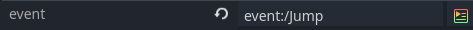
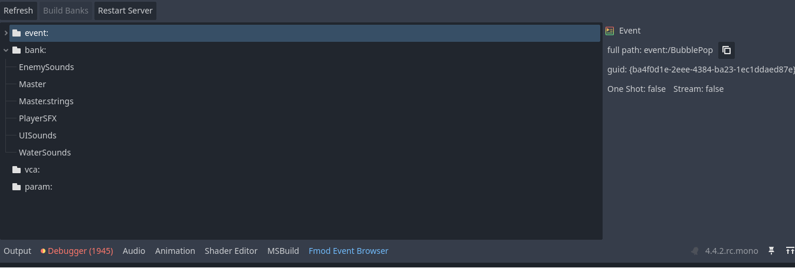
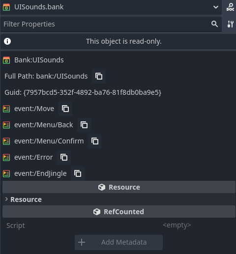
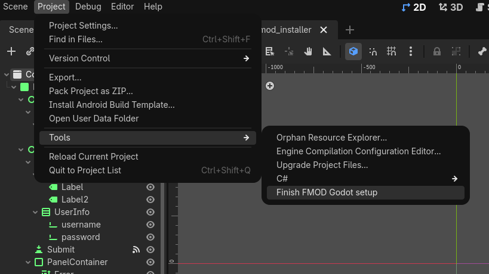

# FMOD Godot  

[Documentation](https://fmod-godot.readthedocs.io/)

## About

Fmod-Godot is a GDExtension library that integrates the Fmod API with the Godot
Engine. The library provides a way for C# to interact directly with the same FMOD
Studio/Core system instances the FmodAudioServer uses. So, it is not limited to
what the integration handles explicitly.  

Unlike [FMOD GDExtension](https://github.com/utopia-rise/fmod-gdextension)
This extension doesn't expose the low-level FMOD and FMOD Studio APIs to GDScript.
The initial design Goal/Motivation of this was to add a high-level integration
with the Godot Engine while allowing C# to use the official FMOD C# wrapper. GDScript
can only directly interact with the newly added nodes

## Features  

### Event tags  

Add a FmodEvent tag to strings or Vector4Is to choose an FMOD_Event from the
inspector to be passed to FMOD API Functions <sub>*Convert will Vector4i to an
    FMOD::GUID with an implicit cast and vice versa</sub>  

``` C#
[Export(PropertyHint.None,"FmodEvent")]
public string soundFX1;
[Export(PropertyHint.None,"FmodEvent")]
public Vector4I soundFX2;
```

``` GDScript
@export_custom(PROPERTY_HINT_NONE, "FmodEvent")
var soundfx1 : String
@export_custom(PROPERTY_HINT_NONE, "FmodEvent")
var soundfx2 : Vector4I
```



### Event Browser

The editor will load all of the banks in the banks folder. and cache them at
startup. to be referenced by inspectors. You can drag and drop events from the browser

  

### Class Overview

- **FmodAudioServer**:
    API to play events. and attach events to objects for specialization, updating
    positions and velocity.

- **FmodBankLoader**: This node
 loads the banks in its bank list when it enters the scene tree. and unload
 them if no other bank loader node is loading the bank. Banks loaded this way
 are reference counted.

- **FmodBank**: Fmod Bank files are imported
into Godot and exported automatically. Banks can be opened in the inspector to view
what events they contain and their GUID.  
  

-  **FmodEventEmitter2D/3D**:
    Plays a selected sound effect. Edit parameters, spatialize the audio, and more

-  **FmodListener2D/3D**: place
listeners into the scene that automatically update their position.

## Supported Platforms

| Platform | Support | Notes                                             |
|----------|---------|---------------------------------------------------|
|Linux     |✅       |Manually Tested                                    |
|Windows   |✅       |Manually Tested                                    |
|Other     |❌       |Untested/Unsupported                               |

## Installation and Getting Started

Open project Settings to adjust settings like error logging, banks loaded at
runtime and more.

### Compiling From Source

\[WIP\]
Before starting, you will need to add the FMOD headers and libraries to the appropriate
location. To simplest way to compile this addon to your project is to run the export.py
script example below.

``` python
python3 export.py -p <platform> -o /path/to/godot_project/addons
```

**Flags**  
-o  
    flag specifies where to copy the outputs of the command to notice how it should
    be the path to the addons directory of your Godot project.  
-p  
    flag is currently one of 3 options "windows" "linux" and "all"  
-f  
    skips the prompt asking for your permission to override files in the output path.
-sc  
    skips the compilation steps and copies whatever is currently in the bin
    directory to output path.  
  
Alternatively refer to [Introduction to the buildsystem](https://docs.godotengine.org/en/stable/contributing/development/compiling/introduction_to_the_buildsystem.html)

#### C\# Set-Up

##### Automatic Set-up

Note: you must have python installed to run the installer  

To run the install go to Project > Tools > Finish FMOD Godot setup  

  


Enter your fmod account info and the installer will close once complete

##### Manual Set-Up

You must download the FMOD files from FMOD's website and place the *.cs files
somewhere in your project directory.
  
It is necessary to replace FMOD.VERSION.dll and FMOD.Studio.STUDIO_VERSION.dll
constants to use the proper fmod library version. Which will be found in fmod.cs
and fmod_studio.cs. .so.14 will change depending on what so file you are using.
snippets below

``` C#
    public partial class VERSION
    {
        public const int number = 0x00020309;

#if DEBUG || TOOLS
        public const string logging = "L";
#else
        public const string logging = "";
#endif
#if GODOT_LINUXBSD
        public const string dll = $"fmod{logging}.so.14";
#else
        public const string dll = "fmod{logging}";
#endif
    }
```

``` C#
    public partial class STUDIO_VERSION
    {
#if DEBUG || TOOLS
        public const string logging = "L";
#else
        public const string logging = "";
#endif
#if GODOT_LINUXBSD
        public const string dll = $"fmodstudio{logging}.so.14";
#else
        public const string dll = $"fmodstudio{logging};
#endif
    }
```

### Pre-built packages

[Releases](https://github.com/marcozee03/FMOD-GODOT/releases)

## C# API/Plans

C# is currently able to interact with the FmodAudioServer and from there interact interact with FMOD_Studio_System and FMOD_Core_System objects.
A module version of this extension is in consideration for more natural C# support
