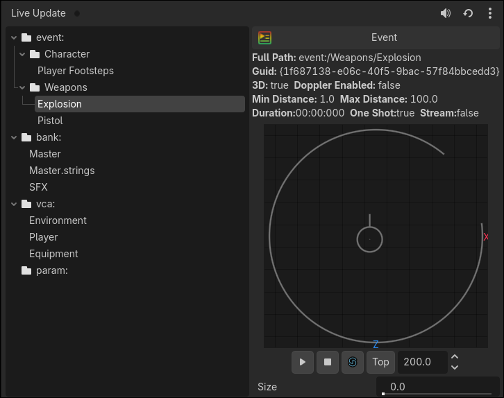
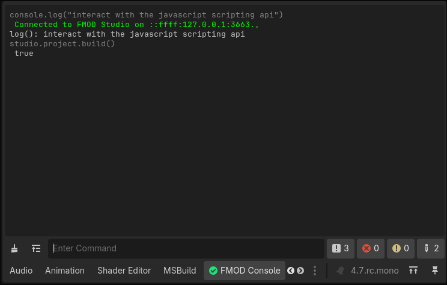
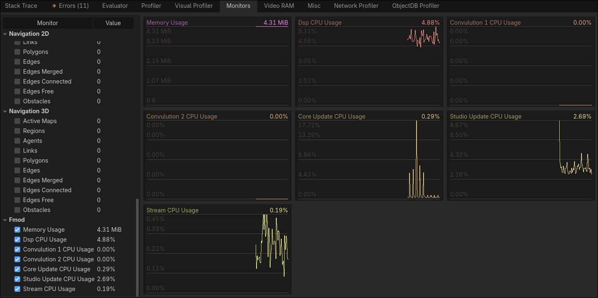
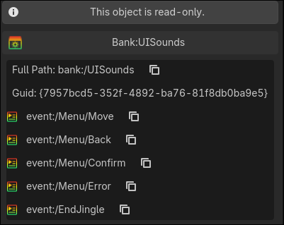
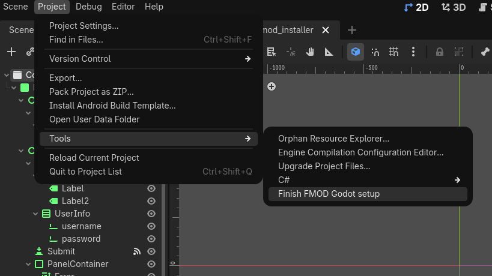
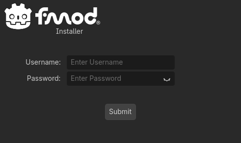

# FMOD Godot

[Documentation](https://fmod-godot.readthedocs.io/)

> [!Note]
> Fmod is a commercial library. This is an Unofficial integration with the godot engine. Check [Licensing](https://www.fmod.com/licensing) for more info.
> For official downloads of the library files check [Downloads](https://www.fmod.com/download)

## About

> [!Note]
> This is beta software. While it should be mostly stable. You may encounter bugs. So please take the time to submit a bug report.

Fmod-Godot is a GDExtension library that integrates the Fmod API with the Godot
Engine. Adding several features explained below and enables use of the Official FMOD C# Wrapper.

## Features

### Event tags

Add a FmodEvent tag to strings or Vector4Is to choose an FMOD_Event from the
inspector to be passed to FMOD API Functions <sub>*Convert will Vector4i to an
    FMOD::GUID with an implicit cast and vice versa</sub>

``` C#
[Export(PropertyHint.None,"FmodEvent")]
public string soundFX1;
[Export(PropertyHint.None,"FmodEvent")]
public Vector4I soundFX2;
```

``` GDScript
@export_custom(PROPERTY_HINT_NONE, "FmodEvent")
var soundfx1 : String
@export_custom(PROPERTY_HINT_NONE, "FmodEvent")
var soundfx2 : Vector4I
```


### Event Browser

The editor will load all of the banks in the banks folder. and cache them at
startup. to be referenced by inspectors. You can drag and drop events from the browser



### Fmod Console

The FMOD console allows you to interact with FMOD Studio's javascript api.


### Performance Monitors

Open Godot's debugger panel and you can track FMOD's cpu and memory usage


### Class Overview

- **FmodAudioServer**:
    API to play events. and attach events to objects for specialization, updating
    positions and velocity.

- **FmodBankLoader**: This node
 loads the banks in its bank list when it enters the scene tree. and unload
 them if no other bank loader node is loading the bank. Banks loaded this way
 are reference counted.

- **FmodBank**: Fmod Bank files are imported
into Godot and exported automatically. Banks can be opened in the inspector to view
what events they contain and their GUID.

  

-  **FmodEventEmitter2D/3D**:
    Plays a selected sound effect. Edit parameters, spatialize the audio, and more

-  **FmodListener2D/3D**: place
listeners into the scene that automatically update their position.

## C#

The FmodAudioServer api is exposed C#. This allows C# to gain direct access to the FMOD System Handles. Allowing you to access the underlying FMOD API exposed through the official C# wrapper. With full access to the rest of the Node/Resource library planned.

### Set-Up

To run the install go to Project > Tools > Finish FMOD Godot setup





Enter your fmod account info and the installer will close once complete

## GDScript
A large subset of the FMOD Studio API is exposed to GDScript. The bindings closely mirrors FMOD's C API.

Also Checkout [FMOD GDExtension](https://github.com/utopia-rise/fmod-gdextension) if you want a higher layer of abstraction over the FMOD API and aren't using C#.

## Supported Platforms

| Platform | Support | Notes                                                                 |
|----------|---------|-----------------------------------------------------------------------|
|Linux     |✅       |Manually Tested                                                        |
|Windows   |✅       |Manually Tested                                                        |
|Android   |🟨       |Builds are untested so there might be unfound bugs or additional setup |
|Other     |❌       |Untested/Unsupported                                                   |
