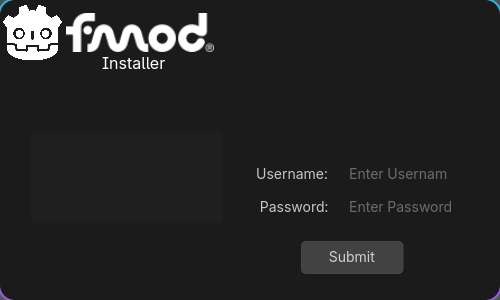

.. _doc_c_sharp_installation_guide:

C# installation guide
===============================
Automatic Install
-----------------

Note: you must have python installed to run the installer

To run the install go to Project > Tools > Finish FMOD Godot setup

.. image:: img/run_installer.png

Enter your fmod account info and the installer will close once complete

Manual Install
--------------
You must download the FMOD files from FMOD's website and place the *.cs files
somewhere in your project directory.

It is necessary to replace FMOD.VERSION.dll and FMOD.Studio.STUDIO_VERSION.dll
constants to use the proper fmod library version. Which will be found in fmod.cs
and fmod_studio.cs. ".so.14" will change depending on what so file you are using.
snippets below

.. code-block::

    public partial class VERSION
    {
        public const int number = 0x00020309;

    #if DEBUG || TOOLS
        public const string logging = "L";
    #else
        public const string logging = "";
    #endif
    #if GODOT_LINUXBSD
        public const string dll = $"fmod{logging}.so.14";
    #else
        public const string dll = "fmod{logging}";
    #endif
    }

.. code-block::

    public partial class STUDIO_VERSION
    {
    #if DEBUG || TOOLS
        public const string logging = "L";
    #else
        public const string logging = "";
    #endif
    #if GODOT_LINUXBSD
        public const string dll = $"fmodstudio{logging}.so.14";
    #else
        public const string dll = $"fmodstudio{logging};
    #endif
    }

.. seealso:: For info on how to compile from source see
   :ref:`Compiling from Source <doc_compiling_from_source>`.
