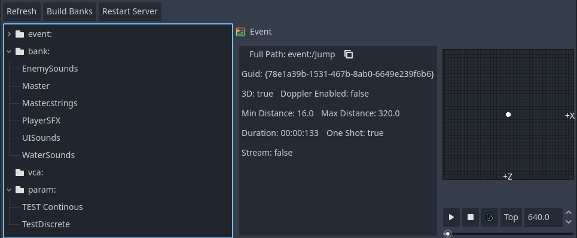

.. _doc_introduction_to_godot:

Introduction to Fmod Godot
==========================

This article is here to help you figure out whether Godot might be a good fit
for you. We will introduce some broad features of the engine to give you a feel
for what you can achieve with it and answer questions such as "what do I need to
know to get started?".

This is by no means an exhaustive overview. We will introduce many more features
in this getting started series.

Overview
--------

* :ref: `FmodAudioServer <class_fmodaudioserver`
    API to play events. and attach events to objects for specialization, updating
    positions and velocity.

* :ref: `FmodBankLoader <class_fmodbankloader>`
    Loads the banks in its bank list when it enters the scene tree. and unload them if no other bank loader node is loading the bank. Banks loaded this way are reference counted.

* :ref: `FmodBank <class_fmodbank>`
    Fmod Bank files are imported into Godot and exported automatically. Banks can be opened in the inspector to view
    what events they contain and their GUID.
  

* :ref: `FmodEventEmitter2D <class_fmodeventemiiter2d>` :ref: `FmodEventEmitter3D <class_fmodeventemiiter3d>`
    Plays a selected sound effect. Edit parameters, spatialize the audio, and more

* :ref: `FmodListener2D <class_fmodlistener2d>` :ref:`FmodListener3D <class_fmodlistener2d>`
    place listeners into the scene that automatically update their position.

Playing Sounds
--------------

Add a FmodEvent tag to strings or Vector4Is to choose an FMOD_Event from the inspector to be passed to FMOD API Functions.

Fmod Godot api calls will convert Vector4i to an FMOD::GUID with an implicit cast and vice versa

.. tabs::
 .. code-tab:: gdscript

    @export_custom(PROPERTY_HINT_NONE, "FmodEvent")
    var soundfx1 : String
    @export_custom(PROPERTY_HINT_NONE, "FmodEvent")
    var soundfx2 : Vector4I

 .. code-tab:: csharp

    [Export(PropertyHint.None,"FmodEvent")]
    public string soundFX1;
    [Export(PropertyHint.None,"FmodEvent")]
    public Vector4I soundFX2;

.. image:: img/exported_event.png

EventBrowser
-------------
The editor will load all of the banks in the banks folder. and cache them at startup. to be referenced by inspectors. You can drag and drop events from the browser

