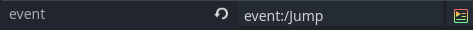
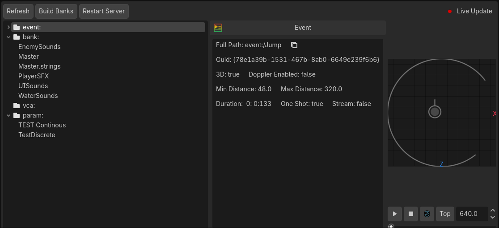

.. _doc_introduction_to_fmod_godot:

Introduction to Fmod Godot
==========================

This article is here to give an overview of the most important features This integration provides on top of the FMOD API. for you. This is not an exhaustive overview.

Overview
--------

* :ref:`FmodAudioServer <class_fmodaudioserver>`
    API to play events. and attach events to objects for specialization, updating
    positions and velocity.

* :ref:`FmodBankLoader <class_fmodbankloader>`
    Loads the banks in its bank list when it enters the scene tree. and unload them if no other bank loader node is loading the bank. Banks loaded this way are reference counted.

* :ref:`FmodBank <class_fmodbank>`
    Fmod Bank files are imported into Godot and exported automatically. Banks can be opened in the inspector to view
    what events they contain and their GUID.

* :ref:`FmodEventEmitter2D <class_fmodeventemitter2d>` :ref:`FmodEventEmitter3D <class_fmodeventemitter3d>`
    Plays a selected sound effect. Edit parameters, spatialize the audio, and more

* :ref:`FmodListener2D <class_fmodlistener2d>` :ref:`FmodListener3D <class_fmodlistener2d>`
    place listeners into the scene that automatically update their position.

Playing Sounds with FmodAudioServer
-----------------------------------
.. note::

    Since godot doesn't support exposing structs to scripting the extension uses Vector4I is cast to FMOD::GUID and vice versa.

Add a FmodEvent tag to strings or Vector4Is to choose an FMOD_Event from the inspector to be passed  to FMOD API Functions.

.. tabs::
 .. code-tab:: gdscript

    @export_custom(PROPERTY_HINT_NONE, "FmodEvent")
    var soundfx1 : String
    @export_custom(PROPERTY_HINT_NONE, "FmodEvent")
    var soundfx2 : Vector4I
    func _jump() -> void:
        # ...
        FmodAudioServer.play_one_shot_by_id(jump, GlobalPosition)

 .. code-tab:: csharp

    [Export(PropertyHint.None,"FmodEvent")]
    public string jump_sfx;
    [Export(PropertyHint.None,"FmodEvent")]
    public Vector4I jump_sfx_str;
    void Jump(){
        //...
        FmodAudioServer.PlayOneShotById(jump, GlobalPosition)
    }

EventBrowser
-------------
The editor will load all of the banks in the banks folder. and cache them at startup. to be referenced by inspectors. You can drag and drop events from the browser

