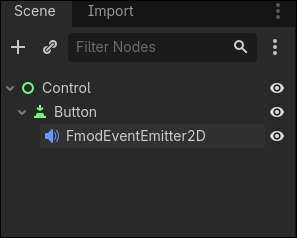
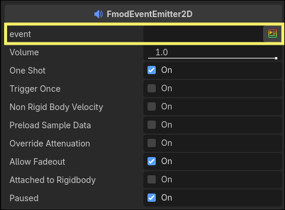
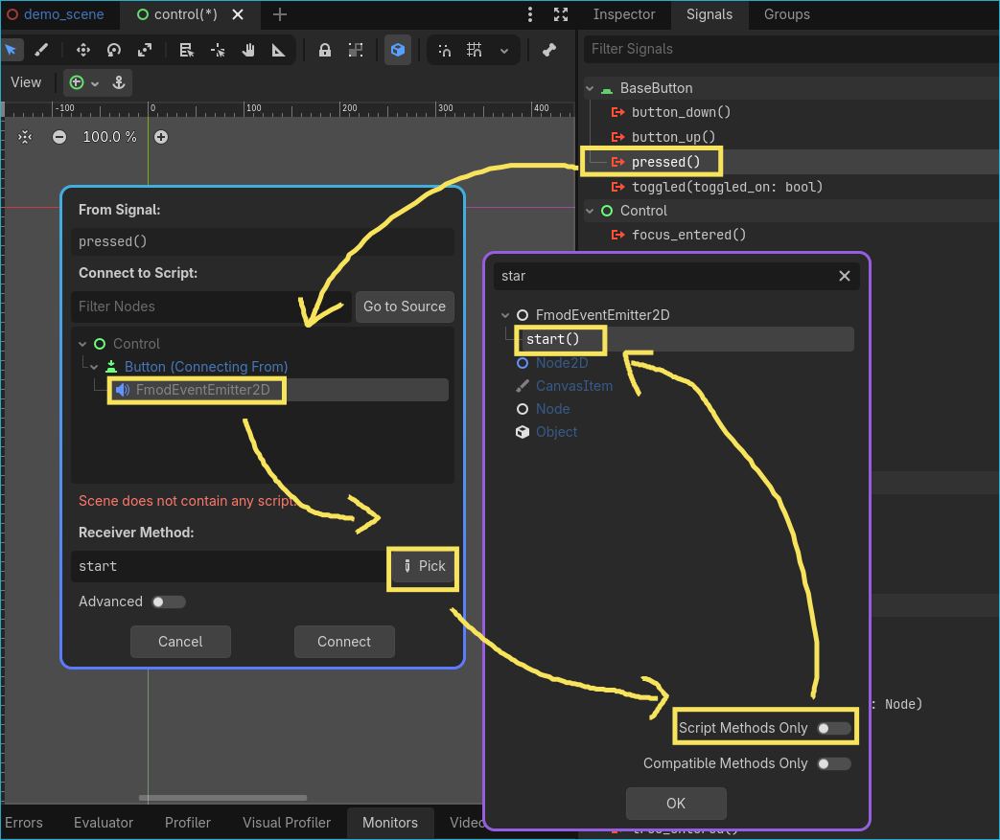

.. _doc_playing_sounds:

Playing sounds
============================
.. note::

    Since godot doesn't support exposing structs to scripting the extension uses Vector4I is cast to FMOD::GUID and vice versa.

Playing sounds in code
----------------------
To play sounds in code
* Export a Vector4i or String property

.. image:: ../../images/exported_event.png

* Set the event in the inspector
* Call FmodAudioServer.play_one_shot or FmodAudioServer.play_one_shot_by_path().
Example below.

.. tabs::
 .. code-tab:: gdscript

    # jump_sound can also be a string
    @export_custom(PROPERTY_HINT_NONE, "FmodEvent")
    var jump_sound : Vector4I
    func _jump() -> void:
        # ...
        FmodAudioServer.play_one_shot(jump, GlobalPosition)

 .. code-tab:: csharp

    // jump_sound can also be a string
    [Export(PropertyHint.None,"FmodEvent")]
    public Vector4i jump_sound;
    void Jump(){
        // ...
        FmodAudioServer.PlayOneShot(jump_sound, GlobalPosition)
    }

Playing sounds using signals and event emitters
-----------------------------------------------
Refer to `using signals`_ for information about signals in godot.
In this example we will make a button make a sound when clicked.
* Add a button to your scene
* Add an EventEmitter2D as a child of Button

* Set the event to play with the emitter

connect the pressed signal to EventEmitter.start()

.. _using signals: https://docs.godotengine.org/en/stable/getting_started/step_by_step/signals.html
