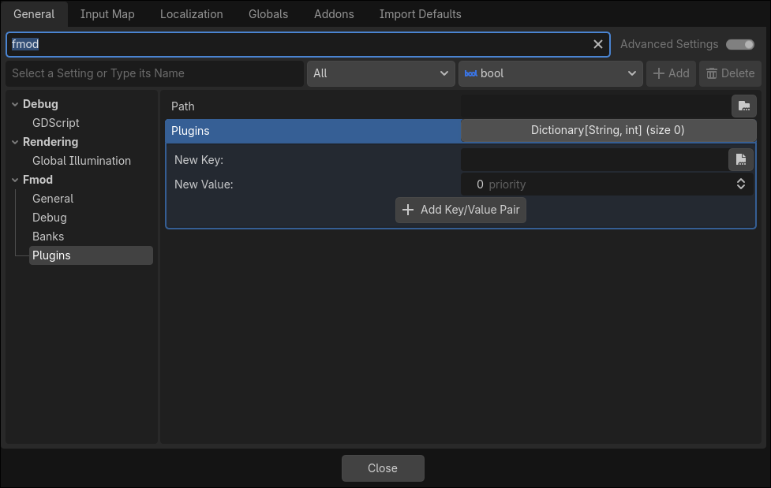

.. _doc_using_studio_plugins:

Using Studio Plugins
====================

For general information refer to `fmod plugin docs`_

Configuration
-------------
Project Settings
^^^^^^^^^^^^^^^^
*fmod/plugins/path*: If this is set, the filename parameter of System::loadPlugin is assumed to be
relative to this pathe.

*fmod/plugins/plugins*: Dictionary from plugin path to priority. If different shared libraries are needed for different platform use can use `feature overrides`_.

Once it's configured that's it

.. _feature overrides : https://docs.godotengine.org/en/stable/tutorials/export/feature_tags.html#overriding-project-settings

.. _fmod plugin docs: https://www.fmod.com/docs/2.03/api/dsp-plugin-api-guide.html
